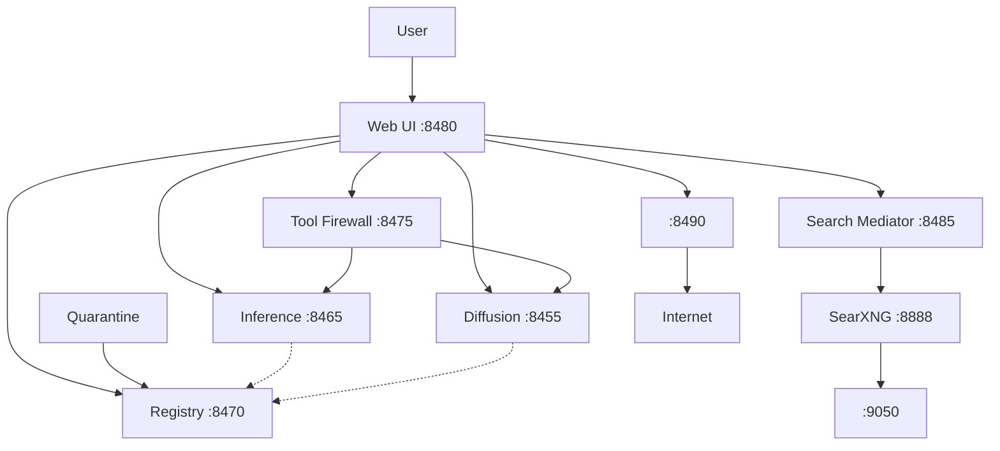

# SecAI OS Service Dependency Diagram

## Mermaid Diagram

## Explanation

### Core Data Flow

- **User** interacts exclusively with the **Web UI** (port 8480). There is no direct
  access to any backend service from outside the appliance.

- **Web UI** orchestrates all operations: chat, image generation, model management,
  vault control, and emergency actions. It talks to each backend service over
  localhost loopback.

### Inference Path

1. User sends a chat message to the Web UI.
2. The UI performs a pre-inference integrity check against the **Registry** (port 8470)
   to verify the active model's SHA-256 hash has not been tampered with.
3. If the model passes, the UI forwards the request to **Inference** (llama-server,
   port 8465) for completion.
4. If the LLM produces a tool call, the UI sends it to the **Tool Firewall** (port 8475)
   for policy evaluation before execution.

### Diffusion Path

1. User requests image or video generation through the Web UI.
2. The UI forwards the request to the **Diffusion** service (port 8455).
3. Diffusion models are loaded from the **Registry** (dotted line indicates
   model-loading dependency, not a per-request call).

### Search Path (when enabled)

1. The Web UI sends the user's query to the **Search Mediator** (port 8485).
2. The Search Mediator strips PII, applies differential privacy (decoy searches,
   batch timing, query generalization), pads the query to a fixed-size bucket,
   and forwards it to **SearXNG** (port 8888).
3. SearXNG routes the search through **Tor** (SOCKS proxy, port 9050).
4. Results flow back through the same chain, are sanitized (HTML stripped,
   injection patterns detected), and returned to the UI as context for the LLM.

### Model Ingestion Path

1. The **Quarantine** pipeline (file watcher) picks up new model files from
   `quarantine/incoming/`.
2. It runs a multi-stage scanning pipeline: source verification, format gate,
   hash pinning, signature check, static scan (modelscan + gguf-guard),
   and behavioral tests.
3. On pass, it calls the **Registry** promote endpoint to register the model.
4. On fail, the model stays in quarantine with a rejection report.

### Egress Path (when enabled)

1. When the **Airlock** (port 8490) is enabled, the UI can make controlled
   outbound requests (e.g., model downloads from Hugging Face).
2. Every request is validated: destination allowlist, method check, body size,
   PII/credential scanning, and rate limiting.
3. The Airlock is disabled by default as it is the largest privacy risk surface.

### Dotted Lines

- Dotted arrows (`-.->`) from Inference and Diffusion to the Registry represent
  model-loading dependencies. These services read model files from the registry
  directory at startup or when models are switched, but do not make HTTP calls
  to the Registry on every inference request.

### Service Ports Summary

| Service          | Port  | Language | Purpose                          |
|------------------|-------|----------|----------------------------------|
| Inference        | 8465  | C++      | llama-server (LLM completions)   |
| Diffusion        | 8455  | Python   | Image/video generation           |
| Registry         | 8470  | Go       | Trusted model store + manifest   |
| Tool Firewall    | 8475  | Go       | Policy-enforced tool call gate   |
| Web UI           | 8480  | Python   | User-facing web interface        |
| Search Mediator  | 8485  | Python   | Tor-routed web search sanitizer  |
| SearXNG          | 8888  | Python   | Privacy-respecting meta-search   |
| Airlock          | 8490  | Go       | Controlled egress proxy          |
| Tor              | 9050  | C        | SOCKS proxy for anonymized egress|
